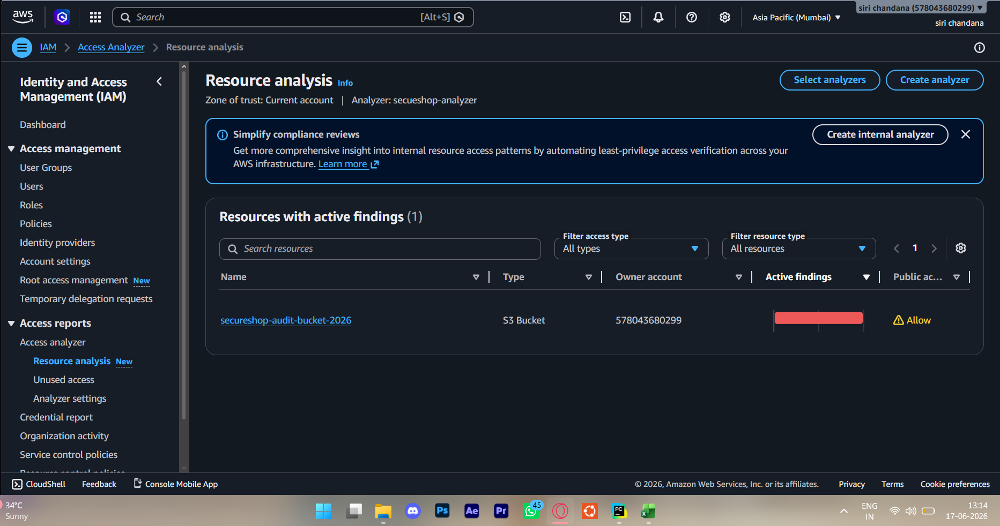
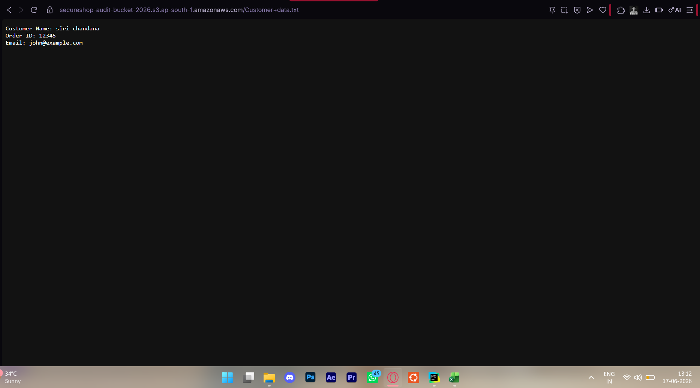
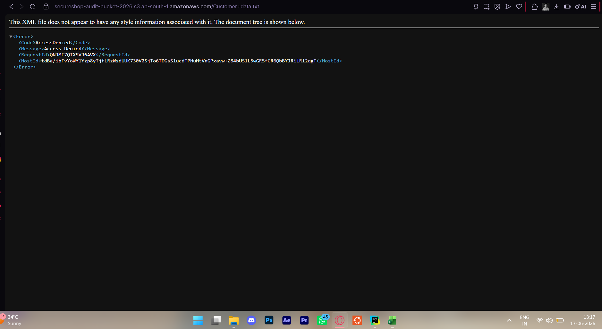
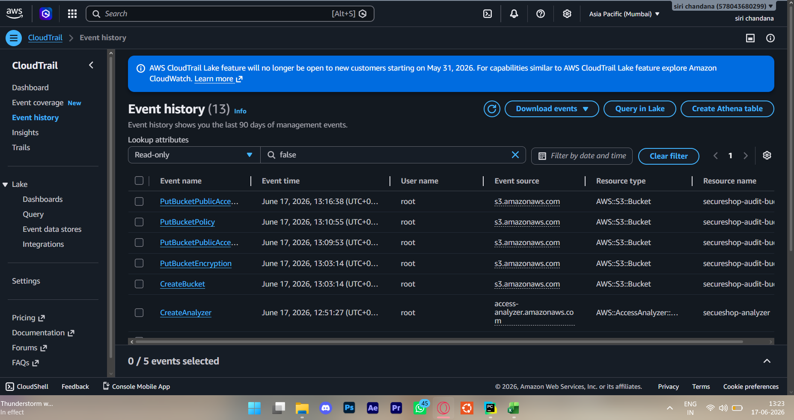

Simulated security audit of a fictional e-commerce startup 
(SecureShop Pvt Ltd) as part of cloud security portfolio development.# aws-cloud-security-audit

AWS Cloud Security Audit Project covering IAM, S3, Access Analyzer, Credential Reports, and CloudTrail.

## Project Overview

This project simulates a cloud security audit of an AWS environment.

The objective was to identify security misconfigurations, validate public exposure risks, review IAM access controls, and investigate audit logs using AWS security services.

## Technologies Used

- AWS IAM
- Amazon S3
- IAM Access Analyzer
- Credential Reports
- AWS CloudTrail

## Security Issues Identified

### 1. Publicly Accessible S3 Bucket
A bucket policy allowed public read access to stored objects.

### 2. Missing MFA Controls
3 out of 4 IAM users had MFA disabled — identified as 
HIGH severity finding. Verified using AWS Credential Report.
| Finding | Severity | Status |
|---|---|---|
| Public S3 bucket | HIGH | Remediated |
| 3 users without MFA | HIGH | Identified |
| No CloudTrail trail | MEDIUM | Documented |

### 3. Excessive Access Risks
IAM permissions were reviewed using least-privilege principles.

## Remediation Steps

- Enabled S3 Block Public Access
- Removed public exposure
- Verified findings using IAM Access Analyzer
- Reviewed CloudTrail logs for audit validation

## Evidence

### Access Analyzer Finding

### Public Bucket Exposure

### Access Denied After Fix

### CloudTrail Audit Logs

## Key Skills Demonstrated

- IAM Security
- S3 Security
- Cloud Security Auditing
- Risk Identification
- Access Control Validation
- Security Remediation
- CloudTrail Log Analysis

## Result

Successfully identified and remediated an exposed S3 bucket while validating controls through AWS Access Analyzer and CloudTrail.
